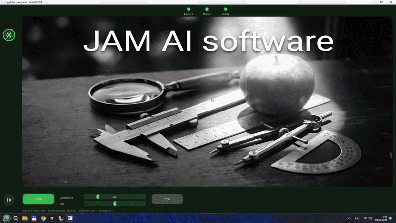
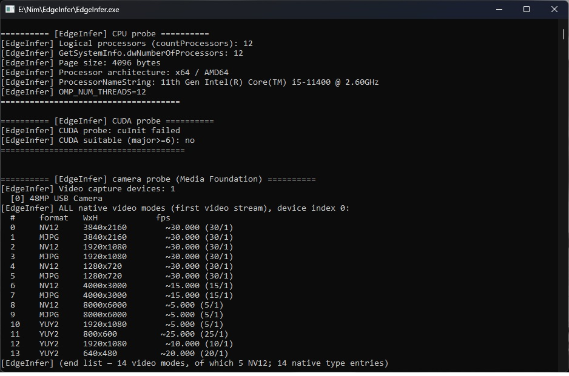
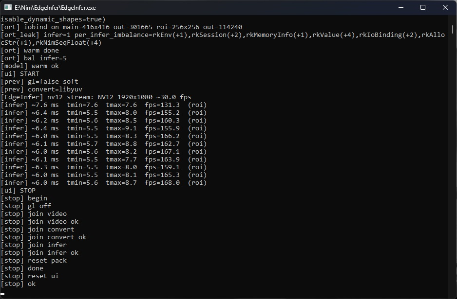

# EdgeInfer

build 1.0.0 · Windows x64 · Nim · ONNX Runtime + OpenVINO · ordinary USB camera

No GPU. No cloud. No Python at runtime. Just a camera, a CPU, and a model file.

Download (Windows x64 zip): [Releases — 1.0.0](https://github.com/olesha-ai/edgeinfer-eval/releases/latest)



My desk setup — Core i5-11400, cheap rolling-shutter webcam, OpenVINO on CPU:




## What it actually is

This is the engine everything else I ship comes from. PanTilt (servo tracking)
and yolox-dmc-inference (industrial DMC detection) are the same core running
under a different `settings.json`. Swap the model path, swap the class list,
same binary underneath.

Ships with a stock YOLOX-nano, COCO-80, untouched weights. Point it at
whatever's in front of the camera — apple, cat, keyboard, whatever class is in
the 80 — and it detects it. No retraining, no fine-tuning, no fuss. That's the
whole pitch: bring your own ONNX model, drop it in `model/`, point
`settings.json` at it, run. If your model runs on ONNX Runtime, it runs here.

## Why it's built this way

Everyone solves computer vision the same way these days: grab the trendiest
model, make it as heavy as possible, rent a GPU that costs more than a used
car. That's fine if you have that budget. I didn't, so I built the other
thing — an engine that runs real-time detection on whatever CPU is already
sitting on the desk.

Two-tensor pipeline (416 full frame + 256 ROI) so the model isn't resized
every frame. Capture (Media Foundation, NV12) → convert thread (libyuv) for
preview → infer thread (letterbox/ROI → ORT + OpenVINO → boxes on screen).
ImGui UI, START/STOP as separate buttons, Space toggles both. Settings lock
while the stream runs so you don't shoot yourself in the foot mid-run.

## Numbers, from my desk

Core i5-11400, no GPU (`CUDA probe: cuInit failed`, and that's the point),
cheap rolling-shutter USB webcam. ROI sits at ~6–7 ms per frame
(~130–170 fps class of infer). Camera itself caps at ~30 fps, so the
bottleneck is the picture, not the net.

Ran it overnight, about 10 hours straight: heap flat at ~3 MiB, private
working set ~182 MiB, millions of inferences, no watchdog restart, nothing
fell over.

I only have the 11400 to test on. If you run this on something else, open an
issue and paste your CPU name, a few `[infer]` console lines, and the camera
model if you know it. Motion blur on fast objects with a rolling-shutter cam
is ugly — if anyone has a global-shutter USB camera and can run the same
build, I want to know what the boxes look like.

## settings.json

Lives next to the exe. Camera index, model path, cat_model path, conf/iou
thresholds, ORT/OpenVINO knobs, tensor sizes — all here. Delete it and
defaults kick back in. Change it through the UI (`S` while idle) instead of
hand-editing if you're not sure what a field does.

Two model slots on purpose: `model` for the detector (the fast, dumb one that
just finds contours and crops a region), `cat_model` for whatever verdict
model you want to run on that crop. I run a 3 MB YOLOX-nano into a 4 MB
LightGBM classifier on the apple demo — divide and conquer instead of one
bloated network trying to do both jobs. Same slot works for anything you
train.

Advanced tab has a memory diagnostics switch — off by default. Turn it on if
you want `logs/run.log` and `logs/mem.log` written to disk. Console prints
`[infer] ...` regardless, that's usually enough for a quick speed check.

## Package layout

```
EdgeInfer.exe
trig.exe          (optional LAN client — Out TCP / Find / E1, same zip)
trig.json         (trig defaults, host/port/auth)
lib/              (ORT + OpenVINO DLLs)
model/            (ONNX — YOLOX line)
settings.json     (created/updated next to the exe)
licenses/         (keep this — OpenVINO / ORT / YOLOX texts)
LICENSE.md
logs/             (only appears if memory diag is on)
```

## Run it

1. Grab the zip from Releases.
2. Unpack somewhere local — not a synced folder if you can avoid it.
3. Keep `lib/openvino/` and `model/*.onnx` sitting next to the exe.
4. Plug in a USB camera, launch `EdgeInfer.exe` from a terminal if you want
   to see the timing lines.
5. Wait for Camera / Model / Ready lamps to go green.
6. START or Space to run, STOP or Space again to stop. Esc asks before it
   quits.

Keys: Space start/stop · S settings (idle only) · Esc exit · arrows adjust
conf/iou.

Don't hammer Space during warmup — give START a second before hitting STOP.

Needs Win10/11 x64 and a UVC camera Media Foundation can actually see. Windows
N editions might need the Media Feature Pack installed first.

## The rest of the family

Same engine, different jobs:

- [PanTilt](https://github.com/olesha-ai/pan-tilt-ai-tracker) — desk visual
  tracking, Nano + PCA9685 neck, servos aim at whatever the detector locks
  onto.
- [yolox-dmc-inference](https://github.com/olesha-ai/yolox-dmc-inference) —
  synthetic-trained Data Matrix code geometry detection, PoC for dot-peen
  marking on industrial parts.

Both are this same binary family with a different `settings.json` and a
different model file. Nothing rewritten, nothing rebuilt from scratch per
project.

## Honest corners I'm not going to hide

- Switching models on OpenVINO MULTI: the old session gets abandoned instead
  of a clean Release call. Tiny leak on the rare model switch, no crash.
  Lines don't hot-swap models mid-stream anyway, so in practice this doesn't
  come up.
- Exit calls `ExitProcess` after a clean shutdown — Windows plus Nim/NiGui
  finalizers otherwise blow up on the way out. Fine for a standalone exe,
  wouldn't do it in a library.
- `settings.json` isn't encrypted. The Advanced tab is for people who know
  what they're doing, not a DRM wall.

## License

See [LICENSE.md](LICENSE.md).

Allowed: testing, teaching, research, sending me feedback.
Not allowed under this license: commercial or factory production use.

This is an evaluation build, not a commercial license. If you need one, we
talk separately.

## Third-party

I didn't invent OpenVINO or ONNX Runtime. This is glue — capture, dual-slot
pipeline, UI, memory discipline around them.

| Component | License | |
|---|---|---|
| Intel OpenVINO | Apache 2.0 | openvino |
| ONNX Runtime | MIT | onnxruntime |
| YOLOX weights | upstream / Megvii line | YOLOX |
| Nim, ImGui, GLFW, libyuv | as usual | see `licenses/` |

Not affiliated with Intel, Microsoft, or Megvii. Names used only to say what
this links against. Full license texts are in `licenses/` — don't strip that
folder from the zip.

olesha-ai · eval only · send me your CPU numbers
